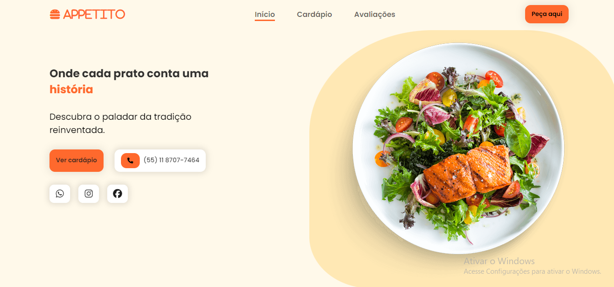
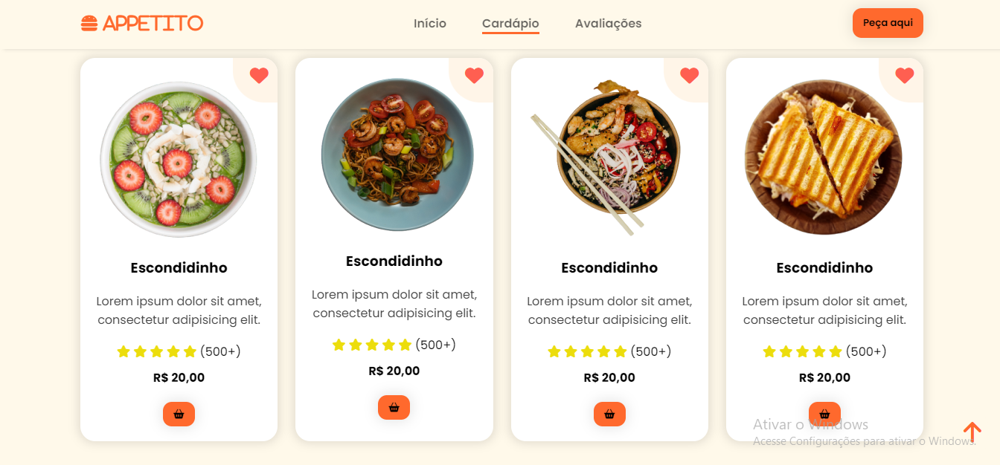
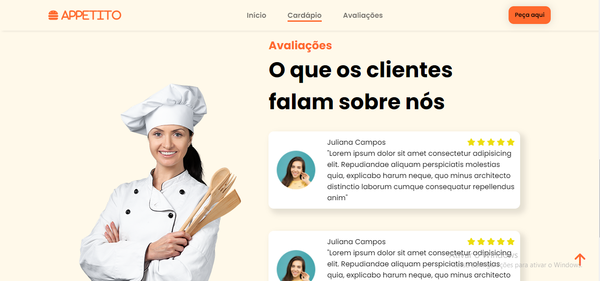

# Appetito Restaurante

## Descrição
Esta é uma landing page para um restaurante, desenvolvida como uma demonstração das minhas habilidades em front-end utilizando HTML, CSS e interações em JavaScript.

## Funcionalidades Principais
- Apresentação do restaurante e seus serviços.
- Menu interativo com informações sobre os pratos oferecidos.
- Sessão de avaliação dos clientes.

## Pré-visualização

## Tecnologias Utilizadas
- HTML5
- CSS3
- JavaScript

- Para visualizar a página e interativa acesse: https://jessicasamppaio.github.io/restaurante/

## Autora
Jéssica Sampaio

